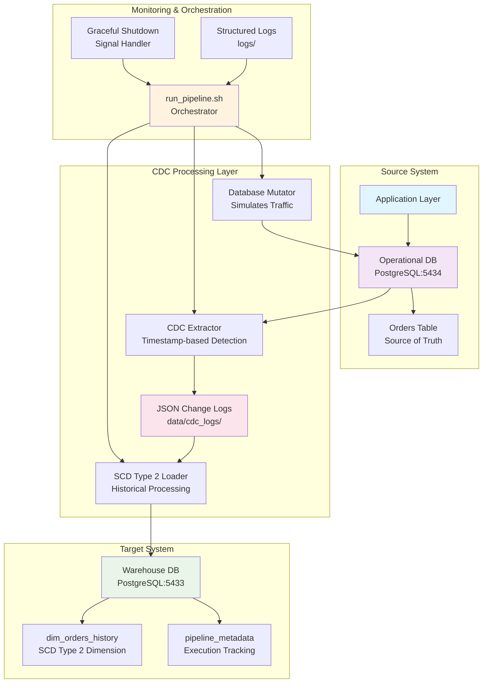

# CDC Historical Warehouse Platform

A production-ready Change Data Capture (CDC) platform that implements SCD Type 2 historical tracking for data warehousing. This platform demonstrates real-world database mutation patterns and provides a complete pipeline for capturing, processing, and storing historical data changes.

## 🏗️ Architecture Overview

The platform follows a three-tier architecture with clear separation of concerns:



## �️ Tech Stack

### Core Technologies
- **Python 3.8+**: Primary development language
- **PostgreSQL 15**: Source operational database and target data warehouse
- **Docker & Docker Compose**: Containerization and orchestration
- **JSON**: Intermediate CDC change log format

### Python Libraries
- **psycopg2-binary**: PostgreSQL database connectivity
- **python-dotenv**: Environment configuration management
- **faker**: Realistic test data generation

### Infrastructure Components
- **Structured Logging**: Comprehensive logging with configurable levels
- **Signal Handling**: Graceful shutdown for production environments
- **Pipeline Metadata**: Execution tracking and monitoring

## 📊 Scale Assumptions

### Current Configuration
- **Source Database**: Single PostgreSQL instance on port 5434
- **Warehouse Database**: Single PostgreSQL instance on port 5433
- **Mutation Rate**: Configurable (default: every 5 seconds)
- **CDC Extraction**: Configurable (default: every 10 seconds)
- **Batch Processing**: Changes processed in configurable batches

### Designed For
- **Small to Medium Workloads**: 1K-100K daily transactions
- **Historical Data**: Complete audit trail with SCD Type 2
- **Development & Testing**: Local development and proof-of-concept deployments
- **Educational Purposes**: Learning CDC patterns and data warehousing concepts

### Limitations
- Not designed for high-throughput enterprise workloads (>1M daily transactions)
- Single-node deployment (no horizontal scaling)
- No built-in high availability or disaster recovery
- JSON-based CDC logs (not optimized for maximum throughput)

## 🎯 Design Decisions & Tradeoffs

### Architectural Decisions

1. **JSON-based CDC Logs**
   - **Decision**: Use JSON files as intermediate CDC storage
   - **Rationale**: Decouples source and target systems, enables batch processing
   - **Tradeoff**: Higher storage overhead compared to binary formats
   - **Impact**: Easier debugging and inspection at the cost of performance

2. **Separate PostgreSQL Instances**
   - **Decision**: Use distinct databases for source and warehouse
   - **Rationale**: Mimics real-world production environments
   - **Tradeoff**: Increased resource usage
   - **Impact**: Better isolation and realistic testing scenarios

3. **SCD Type 2 Implementation**
   - **Decision**: Maintain complete historical tracking with validity periods
   - **Rationale**: Preserves all data changes for analytics
   - **Tradeoff**: Increased storage requirements and query complexity
   - **Impact**: Rich historical data at the cost of storage and performance

4. **Timestamp-based CDC**
   - **Decision**: Use timestamp columns for change detection
   - **Rationale**: Simple implementation, works with PostgreSQL
   - **Tradeoff**: Potential for missed changes if clock skew occurs
   - **Impact**: Reliable change detection for most use cases

### Technology Tradeoffs

1. **Python over Compiled Languages**
   - **Pros**: Rapid development, extensive libraries, easy debugging
   - **Cons**: Lower performance compared to Java/Go
   - **Decision**: Prioritized development speed and maintainability

2. **Docker Compose over Kubernetes**
   - **Pros**: Simple setup, ideal for development and small deployments
   - **Cons**: Limited scaling and orchestration capabilities
   - **Decision**: Focused on accessibility and ease of use

3. **Structured Logging over Basic Print Statements**
   - **Pros**: Better debugging, configurable levels, production-ready
   - **Cons**: Slightly more complex implementation
   - **Decision**: Essential for production monitoring and troubleshooting

## 🚀 How to Run It

### Prerequisites
- Docker and Docker Compose installed
- Python 3.8+ installed
- Git for cloning the repository

### Quick Start (Recommended)

```bash
# Clone the repository
git clone <repository-url>
cd cdc-historical-warehouse-platform

# One-command setup and start
make quick-start
```

This command will:
1. Install Python dependencies
2. Set up environment configuration
3. Start Docker databases
4. Launch the complete CDC pipeline

### Manual Setup

```bash
# 1. Start databases
docker-compose up -d

# 2. Install dependencies
pip install -r requirements.txt

# 3. Set up environment
cp .env.example .env

# 4. Run pipeline components
python src/simulators/db_mutator.py &      # Terminal 1
python src/cdc/log_extractor.py &          # Terminal 2  
python src/warehouse/scd2_loader.py        # Terminal 3
```

### Using the Shell Script

```bash
# Start the complete pipeline
./run_pipeline.sh

# Check status
./run_pipeline.sh status

# Stop the pipeline
./run_pipeline.sh stop
```

### Using Makefile Commands

```bash
make help           # Show all available commands
make start          # Start pipeline
make status         # Check status
make stop           # Stop pipeline
make test           # Run validation tests
make logs           # View recent logs
make clean          # Clean up temporary files
```

## 📁 Folder Structure

```
cdc-historical-warehouse-platform/
├── src/                          # Source code
│   ├── cdc/                     # CDC extraction logic
│   │   └── log_extractor.py     # Timestamp-based change detection
│   ├── simulators/              # Data simulation
│   │   └── db_mutator.py        # Database mutation simulator
│   ├── utils/                   # Shared utilities
│   │   ├── logging_config.py    # Structured logging setup
│   │   └── signal_handler.py    # Graceful shutdown handling
│   └── warehouse/               # Data warehouse logic
│       ├── pipeline_metadata.py # Pipeline execution tracking
│       └── scd2_loader.py       # SCD Type 2 implementation
├── tests/                       # Test suite
│   ├── verify_scd2.py          # SCD Type 2 validation
│   └── technical_audit.py      # Technical audit tests
├── scripts/                     # Utility scripts
├── data/                        # Data storage
│   └── cdc_logs/               # JSON change logs
├── logs/                        # Application logs
├── init-scripts/               # Database initialization
├── docker-compose.yml          # Docker configuration
├── requirements.txt            # Python dependencies
├── Makefile                    # Development commands
├── run_pipeline.sh            # Pipeline orchestrator
├── .env.example               # Environment template
└── .gitignore                 # Git ignore rules
```

## 🔧 Key Challenges Solved

### 1. Atomic SCD Type 2 Operations
**Challenge**: Ensuring that expire/insert operations are atomic to prevent data inconsistency.
**Solution**: Implemented single database transactions that expire old records and insert new ones atomically.

### 2. Race Condition Prevention
**Challenge**: Preventing duplicate current records during concurrent processing.
**Solution**: Added batch deduplication and proper transaction isolation levels.

### 3. Timestamp Precision
**Challenge**: Maintaining precise timestamp relationships between valid_to and valid_from.
**Solution**: Used database-level timestamp generation with microsecond precision.

### 4. Graceful Shutdown
**Challenge**: Handling SIGTERM/SIGINT signals without data loss.
**Solution**: Implemented comprehensive signal handling with cleanup procedures.

### 5. Change Detection Accuracy
**Challenge**: Reliable detection of database changes without missing updates.
**Solution**: High-watermark approach with configurable polling intervals.

## ⚡ Performance Considerations

### Current Performance Characteristics
- **Latency**: 5-10 seconds end-to-end (configurable)
- **Throughput**: Suitable for 1K-100K daily transactions
- **Storage**: SCD Type 2 increases storage requirements by 3-5x
- **Memory**: Low memory footprint (<100MB for all components)

### Optimization Opportunities
1. **Batch Size Tuning**: Adjust batch sizes for better throughput
2. **Index Optimization**: Add database indexes for better query performance
3. **Connection Pooling**: Implement database connection pooling
4. **Async Processing**: Consider async processing for higher throughput
5. **Compression**: Compress JSON logs for reduced storage

### Bottlenecks
- **Single-threaded Processing**: Current implementation is single-threaded
- **JSON Parsing**: JSON processing adds overhead compared to binary formats
- **Database I/O**: Frequent database operations can become limiting factor

## 🔮 Future Improvements

### Short-term (Next 3-6 months)
1. **Connection Pooling**: Implement database connection pooling
2. **Metrics Collection**: Add Prometheus metrics for monitoring
3. **Configuration Validation**: Add startup configuration validation
4. **Enhanced Testing**: Expand test coverage for edge cases
5. **Documentation**: Add API documentation and deployment guides

### Medium-term (6-12 months)
1. **Multi-table Support**: Extend beyond orders table
2. **Schema Evolution**: Handle schema changes in source database
3. **Performance Optimization**: Implement batch processing optimizations
4. **Error Recovery**: Add dead letter queue for failed changes
5. **Monitoring Dashboard**: Web-based monitoring interface

### Long-term (12+ months)
1. **Horizontal Scaling**: Support for multiple processing nodes
2. **Alternative Storage**: Support for different warehouse databases
3. **Real-time Streaming**: Replace file-based CDC with streaming
4. **Cloud Deployment**: Kubernetes deployment manifests
5. **Advanced Analytics**: Built-in analytics and reporting

## 🧪 Validation and Testing

### Running Tests
```bash
# Run SCD Type 2 validation
make test

# Run rapid updates test
make test-rapid

# Run comprehensive validation
make validate
```

### Test Coverage
- **SCD Type 2 Logic**: Validates historical tracking correctness
- **Transaction Integrity**: Ensures atomic operations
- **Concurrency Handling**: Tests race condition prevention
- **Timestamp Precision**: Validates microsecond accuracy
- **End-to-End Pipeline**: Complete workflow testing

## 📋 Configuration

### Environment Variables
Key configuration options in `.env`:

```bash
# Database Configuration
DB_HOST=localhost
DB_PORT=5434
DB_NAME=operational_db
DB_USER=postgres
DB_PASSWORD=postgres

# Warehouse Database Configuration  
WAREHOUSE_DB_HOST=localhost
WAREHOUSE_DB_PORT=5433
WAREHOUSE_DB_NAME=warehouse_db
WAREHOUSE_DB_USER=postgres
WAREHOUSE_DB_PASSWORD=postgres

# Simulation Configuration
MUTATION_INTERVAL_SECONDS=5

# CDC Extractor Configuration
CDC_EXTRACTION_INTERVAL_SECONDS=10
```

## 🚨 Production Considerations

### Before Production Deployment
1. **Security**: Change default passwords and implement proper authentication
2. **Resource Limits**: Set appropriate memory and CPU limits
3. **Backup Strategy**: Implement regular database backups
4. **Monitoring**: Set up comprehensive monitoring and alerting
5. **Log Rotation**: Configure log rotation to prevent disk space issues

### Recommended Production Settings
```bash
# Production-like deployment
make prod-start

# Equivalent manual command
LOG_LEVEL=WARNING MUTATION_INTERVAL=30 CDC_INTERVAL=60 ./run_pipeline.sh start
```

## 📞 Support and Contributing

### Getting Help
- Check the logs in the `logs/` directory
- Run `make status` to check pipeline health
- Review validation reports for SCD Type 2 issues

### Contributing
1. Fork the repository
2. Create a feature branch
3. Add tests for new functionality
4. Ensure all tests pass
5. Submit a pull request

---

**Note**: This platform is designed for educational purposes, development, and small-scale production scenarios. For enterprise-scale deployments, consider commercial CDC solutions or cloud-native alternatives.
